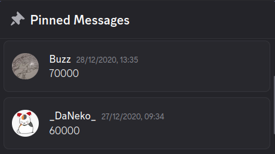
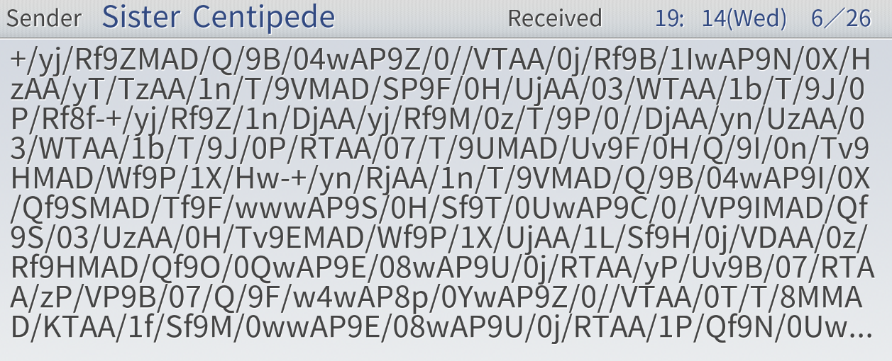
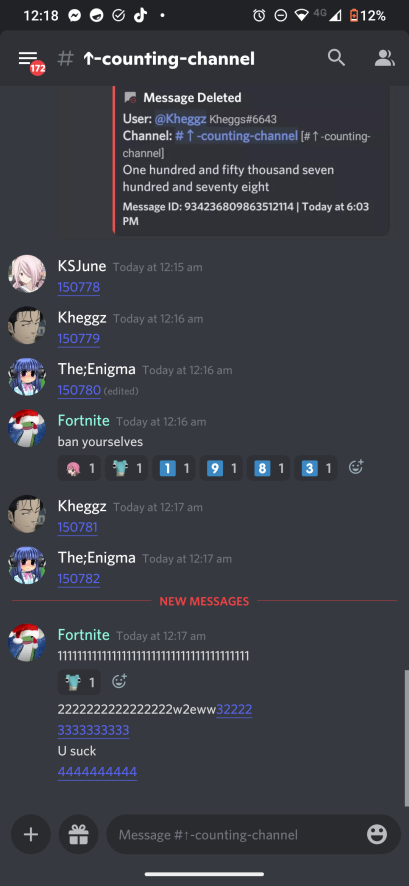
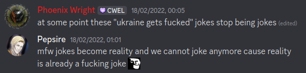
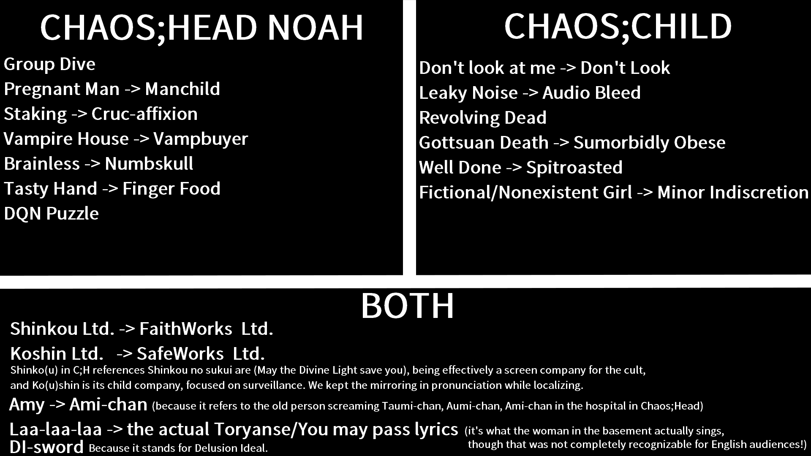
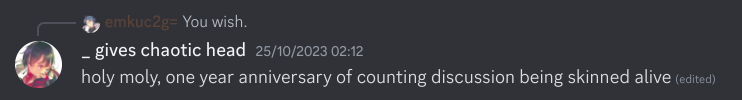
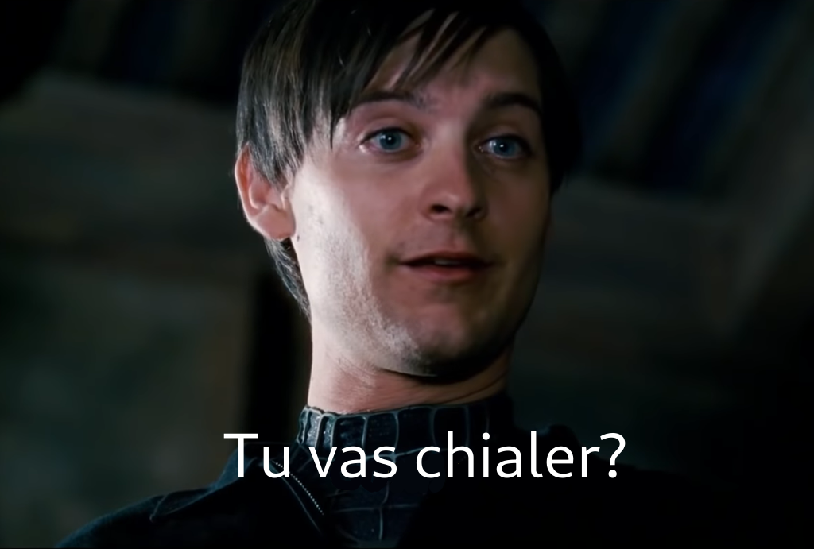

# How to get banned from the main SciAdv server and regret nothing

or Records of a certain SciAdv fan
or From Retanar to goddamned everyone

an imprecise chronological story of events in my life during 2020-2025

### Introduction

Hello, I'm Retanar (nickname). You may also know me by nickname VladLapynov. I would like to tell my story of being in Science Adventure (SciAdv) series communities for years and how it ended up.

### Pre beginning

At the very beginning of my anime journey in 2018, I watched Death Note first, then by sheer luck decided to watch Steins;Gate second (then 0). This simple mistake, or happy accident, would cost me my near future - I was very sad about the story, and I gave up on anime for a while because I didn't believe anything can beat S;G, or didn't want to forget it; and my long term future - me, writing this writing now, is part of that future.

After joining the S;G subreddit and learning about other entries, like Chaos;Head, Chaos;Child, and more I was waiting for the time when I will be able to read those other visual novels (VNs). The time came during 2019, early 2020. I read Chaos;Head PC version, which was a tough experience, as I've never read anything of this size in English, plus the whole vibe of 4:3 aspect ratio with a small window. Then came Chaos;Child, I spent a whole lot of time on it, and it killed me with sadness again.

Naturally I started reading S;G and S;G 0, which was the only choice, due to nonexistent R;N translation, but I don't know if I knew that at the time. I finished these two in around March 2020. Which leads to the beginning.

## 2020

I start my discord adventure in April 2020. That's when I joined the discord server Science Adventure (Beyond the Gate). My English was still not great, although better after having read 4 VNs above. Piecing complex sentences together was hard, I was not a social person, and thus I didn't feel comfortable randomly talking with anyone or joining conversations. So I did the one thing that required no skills: writing numbers in #counting-channel.

### #counting-channel

The idea behind counting channel is straightforward: post the next number after previously posted, don't post directly after your own message.

Accompanying this channel was #counting-channel-discussion. It was a great place to start for an antisocial guy like me. Not the easiest, but still very chill, as we were all united by the same goal. After you started talking, you could go into any topic, so it became a comfy place for me. Counting channel and discussion brought together me and my first discord friends. By the end of 2020 we had counted from 30000, down to -1000, and then up to 70000. Very crazy year for counting channel fuelled by people with too much free time.

At some point, someone half-jokingly suggested to make me a moderator for the counting channel, for all the mistakes I was spotting (too much free time). I wasn't against it and was given a moderator role for that, so now I could fix some errors myself quickly.

### Japanese learning

At the start of 2020 I also decided to start learning Japanese, partly due to untranslated Noah. Wasn't until I noticed the Japanese channel in the main server, that I started making progress and having more fun learning. All thanks to the Mass Immersion Approach (MIA) guide, that was popularized there.

Thus by the end of 2020 I was starting to have a good enough base and trust in myself to later start the unthinkable.

### Reading Robotics;Notes

Released in October 2020, Robotics;Notes Elite was a... mess. The community made sure that people understand it, the translation was not great, and so the great Committee of Zero (CoZ) translation/patch group was on a mission to fix it. It took them about a month to release the first version of a patch, so the community could start treating this VN as playable.

Here is where things started being weird. People were discouraged to read R;N before patch at all by playthrough server admins, CoZ members, and their friends. Even when I wanted to read only a few first hours, I was repeatedly told that I should wait, despite it making little difference for the overall experience.

The patch itself was painful to install, as CoZ was not willing to support any pirated version, despite them being identical to the original. So when I tried to install the patch, it didn't seem like any patch was applied at all. After lucky help from a member, I managed to install it by... moving the game into Steam game folder and setting game folder name to a correct one: `ROBOTICS;NOTES ELITE`. And suddenly the patch was activated successfully. Makes me wonder how could you make a patch in such a way, that it wouldn't work depending on the game placement or a folder name.

And then came numerous patch updates, all were uploaded to GitHub only, which by this day gives me no more than 1.7 MB/s download speed. You can do the math how long does it take to download 700 or 800 MB, then add some time for installation before you can finally play. Furthermore, CoZ launcher constantly had an annoying popup when a new version was released, so it was bothersome to ignore updates. Not a great experience.

But the patch did what it promised to do. It fixed translation errors, added mouse support, replaced less pretty default font, and edited untranslated images. Wasn't a lot to complain.

#### The secret message inside garbled email

R;N had a moment with weird emails, that contained only garbled text in them. I found how to decode it. You are encouraged to read the below section only after finishing R;N.

Spoilers to R;N Elite

You should remember these emails from Airi:

They are encoded in UTF-7 - a format to be used for... _emails_. You may find the exact text in some server or channel, maybe even get it yourself from the script. I unfortunately don't know where I can find it. At any rate, I can provide the decoded version, which consists of three sentences:

<ol>
<li>(EY CAN YOU HEAR ME $O YOU HEAR MY VOICE</li>
<li>(EYY (ELLOOO )S MY VOICE NOT REACHING YOU</li>
<li>)F YOU CAN HEAR ME RAISE BOTH ARMS AND YOUR RIGHT LEG AND DO THE #RANE 3TANCE )F YOU DO ) WILL DO THE SAME</li>
</ol>

### Divergence Meter development

Because I was into android development, for now unknown to me reason, probably during my reading of S;G, I decided to make a widget with divergence meter. In April 2020 I made initial commit to my git repository. In a few weeks I had a minimally working app. It was quite interesting, although messy.

By April 2021, I stopped working on it completely. There wasn't a lot I wanted to add, and some things seemed too hard to begin. The app worked fine already, so why touch it.

## 2021

And so, we move into 2021, where my story still continues, but not as peacefully.

Sometime this year the server name was changed to "Beyond the Gate".

### #counting-channel 2 - rotation with #one-word-story

Counting channel seemingly had slowed down, although looking back at it, at the start of 2021 we were at 70k. In March we reached 100k, and by the end of 2021 we reached 146k.

I even created a comparison of top counters during 0-100000 time, you can find this message yourself.

**Top 10 counters from 100k session.**

1. \_DaNeko_#1901: 22320 numbers
2. Buzz#1014: 15080 numbers
3. VladLapynov#2070: 13097 numbers
4. The_Lurker#3228: 6671 numbers
5. tokamak#5132: 5734 numbers
6. -Salem-#2036: 3348 numbers
7. ! ! ProbablySora#7691: 3005 numbers
8. Mariofluffy#7230: 2798 numbers
9. kuroblakka#4381: 2795 numbers
10. isisancheza#4324: 2615 numbers

After reaching 100k, a poll was put out about rotating counting channel with a new channel #one-word-story every two months. And it succeeded. Point of the new channel was to post one word per message to create sentences and hopefully a story.

### Reading Chaos;Head Noah, moving to Love Chu Chus, and finishing SciAdv

Equipped with the MIA guide, mouse-over dictionary Yomichan, VN texthooking guides, and sheer will, I decided that the time to start Noah is now.

It was quite tough, but totally worth it. Ended up spending about 180 hours in 3.5 months. To sum up: I started learning Japanese, stumbled along the learning way, picked my comfortable path - MIA guide, and finished Noah in under 1.5 years - until mid 2021. All while CoZ still didn't finish anything.

So me and 2 of my friends waited for each other to finish Noah, and went ahead to read Chaos;Head Love Chu Chu (C;H LCC) together. Didn't go as smoothly as I expected, however in the end we all did finish it _somehow_. After that, into C;C LCC I was going alone.

The situation around Chaos;Child Love Chu Chu was tough in 2021, comparing to the following years, there was no real way to run it on PC. It was only released for PS4 and PS Vita, with non existent and not working emulators respectively. But of course CoZ couldn't forget to mention that they are working on their own engine that would allow to run LCC games, sometimes saying that it actually works.

In reality, nothing was working for a general user. Seemed like CoZ developers weren't interested in working on it. They could write that many features were working and post updates, but out of the box there was no way to run anything.

In late October 2021, I finished C;C LCC. Thus, having finished all current SciAdv VNs with some exceptions, I was "done" with SciAdv. Nothing else remained, except the wait for Anonymous;Code. Learning Japanese has really paid off, I was grateful that I started it and kept doing it.

### Side servers (idk how to call it)

February 2021, I was introduced to a server named Trigonometry. A gathering of mostly SciAdv people, in a smaller community (under 100 members), with more activity. The concept was very weird for me, my thoughts were "Why move activity to this server, instead of being active in the main server?". But it turned out to be not as bad, and I got to meet new people, including some that weren't in the main servers.

One of such characters was a banned user from most if not all main servers (no names called, but those who know - know). Later he was banned from Trigonometry too, and so I was introduced to his own server, let's call it server AAA (An Assortment of 'A's). Once again, it was a nice, enjoyable collection of people, just a fraction was from SciAdv world, others were from Re:Zero, Umineko, and maybe more.

In parallel, I managed to get myself "limited" by May in Trigonometry, and left it in September. My main issues were with the way it was run, and getting tired of too much activity, which I couldn't follow. So I became even more active in AAA, it was my main side server for a while.

### Few things about CoZ

One day I got into a conversation revolving about who knows what. As a part of it I was presented with some new info on how CoZ treats other translators. Well, they treat others badly, their attitude is horrible. But the evidence is scarce, so the main source is just hearing other people's views, like you now read mine.

Some other people were complaining about certain CoZ members, like rigs and Enorovan, for being too arrogant, haughty, having privileges in the main server (which is run by CoZ members, so not surprising). About entire group being slow to translate. My own opinion was that we would never get C;C LCC from them, because they didn't care about people.

Community, which includes CoZ, were quick to attack other people for having "wrong" opinions/beliefs, like not wanting to install CoZ patches for S;G VNs, which had the best original translation out of SciAdv vns.

### People that we lost

In 2021 I have started to accumulate direct messages (DM) with now deleted accounts. Because I can't tell when an account was deleted, I will sort them based on when was the last message in our chat. Each heading will have a username that is now displayed by discord for deleted accounts, looking like deleted_user_\<some number sequence\>.

#### deleted_user_5998b66b0544

First one is a new account of a weird guy previously nicknamed "TakumiNishijou", previously maybe "John Titor". As far as I remember, his first account was spamming in the main servers' spoiler channels, second account started doing similar things later, spamming with A;C spoiler tags for anything. The reason why I even have this chat and know this information is that our DM started with me sharing Noah SD port files with him. After 5 minutes he revealed to me his identity. It didn't go well from there, when he started spamming in servers and occasionally in our chat.

#### deleted_user_60294190b622

Re;Volution was a Japanese karaoke guy, who sometimes appeared in the voice chat of the main server to sing SciAdv songs. Those were very entertaining times, people requested songs, Re would sing them to the best of his abilities. My direct message history with him starts in November 2020, from that time he joined to sing for a few months, and then stopped almost entirely. In August 2021 he sent me 2 recordings of "Hacking to the Gate" and "Skyclad Observer" asking me to compare the quality with voice chat quality. I still luckily hold on to these files. Our last little chat was in September 2021 about some A;C things, Tesla, and numbers 3 6 9, but I cannot recall the specifics. By the end of the year, Re;Volution disappeared, deleted his account, and removed all messages.

#### deleted_user_fe543ce253b6

This person was in AAA server for some time, then got banned by the admin for very questionable reasons. We talked about that, and nothing much after. Don't know much about their current status.

#### deleted_user_35bbc3ab4bd9

This was a "newbie" to SciAdv, and it was very entertaining to read their playthrough channels, the VNs were read at a quick pace. We had a few drunk text chats together, for which I'm grateful, as this person was quite an entertaining storyteller and very chill. I followed them on a new account for some time, then they disappeared into other series.

## 2022

The fun times cease to exist.

### #counting-channel 3 - the end of counting as I knew it

150k count was reached in January of 2022. I believe on the day or during next few days, counting channel had turned into a shitshow by one of the mods Fasty (almost no records exist about the shitshow). At which point I was done with counting. After some time, counting channel was cleaned from spam, and closed for about 3 months, only to be revived as a channel for posting the word "the".

The counting activity was reduced greatly when the channel returned to counting. Moreover, in October 2022 the discussion channel for counting was, quote: "skinned alive" and "butt fucked", and stopped being a fun place, becoming heavily moderated to only be about reporting errors.

### The (bigger) War

You may not know, but Ukraine has been at war since 2014. The full scale invasion on 24 February 2022 fucked things up a lot for most citizens.

During my retreat from a capital, I downloaded an entire discography of "Ling tosite sigure" (凛として時雨), cause I was listening to some of it before and was starting to like it. It became maybe the first and only music band that I had ever loved so much in my life.

Quite expectedly, in the following months I gradually dropped contact with russians from discord. Then, with some accidental help from my (russian speaking) friend, I learnt a skill of speaking Ukrainian even with russian speakers. By now I almost forgot russian, due to not using it.

One of the jokes I joked at that time, was that the (bigger) war started to not let Ukrainians play A;C. Didn't stop me.

### A;C release

In summer 2022, Anonymous;Code was finally released in Japanese. I started it shortly after the release, was pretty good. At that time I left the main server to avoid people accidentally or intentionally spoiling the game. Looking back, it was a great decision, even though I left only to finish A;C. This was also one of the first VNs that I didn't rate on vndb, instead just wrote "Good" as a comment.

### Noah PC release (official translation)

Holy shit, nobody saw that coming and yet new Noah port for PC with English translation was announced to be released in October 2022. Of course CoZ had not finished the port at the time of announcement, nor by the release date, so of course they ended up promising a patch for the released port. And boy, was there a lot of noise around the port. CoZ was shitting on it everywhere, from every angle, in all formats, so of course you needed to wait for **their** patch to read this VN.

At some point they had a twitter thread where they roasted official translation, I think it was by ChrisGLink. Then it disappeared, but you maybe can find some bits on archive sites like [archive dot is](https://archive.is/https://twitter.com/ChrisGLink*).

And so they promised the patch for October. Then for November. Then by the end of this year. Then they did a genius move and stopped promising dates. Finally, they finished the patch by February 2023, of course posting it on GitHub, with 2 GB archive size. And then immediately the next day they released an update.

What is also interesting in this story, are all other patches. For example, before 2022, C;C patch had last been updated in early 2019. But due to CoZ's version of Noah, in which they changed a lot of terminology, C;C received an update in April 2022 - almost 10 months before Noah patch release.

Some of the things that were changed in C;H and C;C were explained on their website and on a summary screenshot posted in the main discord server's C;C channel.

C;H Noah and C;C spoilers ahead

The link to their website is <a href="https://sonome.dareno.me/2022/05/01/chaos-case-names-masterpost.html">here</a>. However, you are also encouraged to visit previous versions of the website on the <a href="https://web.archive.org/web/20220501211028/https://sonome.dareno.me/2022/05/01/chaos-case-names-masterpost.html">wayback machine</a>. These changes have caused a few controversies, however anyone mentioning them is quick to be silenced by the community and CoZ members.

Next is a screenshot from discord.

Some questionable decisions, in my opinion, which CoZ seems to not be able to explain in a satisfying way. In addition, the consistency that they claim to support with their patches, here is clearly disturbed in favor of the _new_ consistency. Should I even mention changing the iconic "If you are god..." subtitle by CoZ?

One more thing, the unnecessary renaming of Committee's name in Sena's route. What originally was "禁（０漸Ｖ・＄" became:

This is especially painful for me, who after decoding R;N thing described earlier, tried decoding this. Unfortunately unsuccessfully, however I still believe it's doable. Meanwhile CoZ, who certainly didn't even try to decode it, instead of leaving it as is, decided that it's okay to change it to a random thing.

### Other servers 2

In a peculiar turn of events I was banned from AAA server. So that is one less server connected to SciAdv. The ban wasn't uncalled for, I basically laid down my issues with the server and/or server owner in a bit impolite, not rude manner, and the owner decided to not handle it or me.

No other server really stuck to me, even though I didn't try many, so I had never become anyone else except SciAdv guy. Only exception was joining S;G France server, on the day when bigger war started, as a joke.

### People that we lost

#### deleted_user_fbef73fe6cec

An active user's discord account was banned this year under peculiar circumstances, reported to discord from what I had heard. I wasn't friends with them, wouldn't even tell that the ban was in 2022, if not for one message just before complete ban, sent because I suspected something was off. It sure was off, now you can't find this user on discord anymore.

#### deleted_user_6744da8a38c5

Weird person overall, probably switched to another account. Have no memories of them.

#### deleted_user_f2db958836c8

My dear friend, one of the first ones and good ones, Isisancheza. When asked why was the account deleted, I got unclear response, so I didn't pry further out of respect, and believe he did nothing wrong.

#### deleted_user_3b01b52c0a6c

Not sure this account is actually deleted, and another older account seems to be doing fine, but this person is now listed as a previous CoZ member. As opposed to most of CoZ, they were a good person to talk to, and I got scripts for A;C from them, which was the only conversation we had. No idea what happened with this account and when.

## 2023

Honestly not much has happened during these years, I have genuine issues remembering anything interesting.

School classmate died from cancer.

I graduated from university, and got a mediocre job by October.

Twitter became owned by musk.

I left the main server (for the second time) cause I had enough.

### counting-channel 4

### Noah translation patch release by CoZ

Finally, the wait was over, and CoZ released their patch (with day 1 update) in February 2023. Surely it ended up being praised by supporters, and cursed by opposers. However just like the tweets from CoZ, by now some evidence was removed, some was lost in history. Take r/visualnovels for example, which had biggest threads complaining about issues of CoZ translation (I guess they banned CoZ posting around at that time).

- Here's one complaining about changing a joke, with lots of comments about CoZ in general: https://www.reddit.com/r/visualnovels/comments/10v09s3/committee_of_zero_c0z_patch_for_chaoshead_noah/
- Here's one from 2024, that was deleted, but comments remain: https://www.reddit.com/r/visualnovels/comments/1beu24s/so_about_the_chaoshead_noah_coz_patch/. Still, one can find it on internet archive.

### A;C English release

CoZ's "smallest" patch took almost 4 months to release (with a ~~day~~ week 1 update of course). Surprisingly, they released 2 versions: one that changes everything according to other patches, and one that matches English spoken lines. According to my memory, CoZ updated some previous patches to support A;C terminology, but I can't back that up (most changelogs just say "consistency fixes"), plus A;C has been out for more than a year, so it could've been done before English release.

By this time, I was very uninterested and uninvolved in SciAdv community, so I had no idea what the general reception of A;C was like (I still don't know much, only that it's not hated), or what are relations to other entries.

### People that we lost

#### deleted_user_09da0be7700b

A friend of mine, switched to another account, so we still talk sometimes. Account deletion was probably nothing more than a whim.

#### deleted_user_ef838a5b7a95

A guy since counting channel days, mainly talked only there too. Had not heard from him in a while. Until he contacted me randomly in 2023. We talked a little about random things and counting nostalgia. Disappeared as suddenly as appeared, never heard from him again.

## 2024

Even less happened this year.

### Games I'd dropped, life I'd not lived

Job was taking a some of my time, and contributed to my overall tiredness. I had been bored with usual media like anime, games, visual novels for a long while. Still am. But what I had been (moderately) proud of, was finishing whatever game/anime I started.

Not anymore. By 2024, my vndb accumulated 3 VNs that I started, **liked**, but never finished fully, and another VN that had received its last chapter, that I didn't have a will to read. Similar story with games, I would start a game, have some fun with it, and become unwilling to continue it. Some of those were fair choices, like games without a clear end - Cuisineer. Others were not logical - Ghost of Tsushima, looked very forward to it, stopped playing after finishing a third of it.

With anime in general it became a hard task to force myself to go watch the next episode of an already started anime. Due to this, I became very hesitant about starting anything new, if it didn't spark great interest in me.

This all, coupled with failed attempts in guitar and writing, made me feel like I don't have a place in this world or still can't find it.

### Keyboard building?

For whatever reason, I decided to design and build my own keyboard. And switch to Colemak after building.

A lot of keyboard/tech words completely unrelated to SciAdv.

Brainwashed by people explaining where did QWERTY layout come from and why rows are weirdly shifted (staggered), I became interested in ortholinear keyboards. But keyboard world is weird. First of all, prices - everything unusual costs half a leg. Second, general bias of ortho community towards smaller keyboards. I don't know why or how people are using keyboards with 40 keys and less, when 61 key (60%) keyboards are already weird to use. Third, designing a key arrangement myself means ability to measure distances accordingly to my hands and fingers.

So, I stumbled upon idea of building a keyboard myself, learned, made PCB design, calculated first costs, shocked myself cause it was close to $100, still kept at it, while trying to reduce some costs, finally got everything, and soldered it together. The result was... not great. I did not learn 3D modeling, even though I tried, so I didn't have a case, and switches were soldered directly on the pcb. For a month the keyboard was laying directly on pcb with diodes, then I got little standoffs, covered pcb with foam supported by screwed standoffs, so now keyboard is standing on them. Usability was tough, I couldn't get used to it.

Colemak layout was also not great. You begin to realize how many things are relying on and exclusively using Qwerty. Some things change shortcuts to new keys on Colemak, but revert to Qwerty if I change keyboard to another language, like to Ukrainian. Then there is IntelliJ, which uses a single layout for shortcuts, probably the one you had at the moment of it starting up. Bios, first lock screen on Gnome use Qwerty only. Japanese IME on linux uses last layout, so Colemak can work, while on Windows it's only Qwerty. And so on.

Results: Colemak will bring issues. Custom keyboard - even more issues. Only if you really have nothing to do, or in dire need, try Colemak (DH mod) first, keyboard building second.

### Other servers

I rejoined Trigonometry, due to previously having a Monogatari watching channel there, and Monogatari getting a new season, so I asked to continue it. Moderately missed people and discussions too, certainly didn't miss some users.

### About CoZ LCC

Love Chu Chu translations were first officially announced by CoZ in February 2023, and not at 0%, but a whole 65% and _unknown%_ for C;H LCC and C;C LCC respectively.

Next update, January 2024. C;H LCC is at 70%, C;C LCC is at... 100%? Somehow that's how math works for CoZ. 5% for "we’d like to focus on first" entry, and from "we have gotten started" to 100% for another entry.

They still don't mention in bold that the port/engine is nowhere near ready, because why do that if you can post a video where C;H LCC is running at least a little on their engine. Although they finally wrote about a possibility of releasing a patch for emulators. But knowing CoZ and seeing their speed, you are not getting anything in the next years, as they will most likely wait for their own engine.

But wait! The above was about their second report on LCCs. They had another report in October 2024. So what do we have now? C;H LCC is at almost 97% of translation, and C;C LCC is fully translated, checked, edited - actually at 100%. So what, the release is near? No, of course, the engine is not ready. But what about the emulators? Well of course CoZ was only talking about C;H LCC, because for some reason Vita emulator that runs C;C LCC well since around 2022 is not an option. And I've tested Vita emulator, it could run it, albeit with some issues in the past, but those were fixed much quicker than CoZ develops their engine.

Now for a little bigger speculation from me. I don't think CoZ tries to release one VN before another. Quite the opposite: they may be going for a double release. Otherwise I can't imagine a good explanation for why had CoZ switched from prioritizing C;H LCC, which in their own words runs perfectly on PS3 emulator, to fully finishing C;C LCC that has to wait for the engine to finish.

## 2025

3rd year of war, peace in 24 hours, peace in 100 days, still AI boom, layoffs, nostalgia, 28 summers.

### Rereading C;C

I started rereading Chaos;Child in Japanese. You can imagine that I was fed up with CoZ, thus I didn't want any of their "artistic vision", and wanted a refresher on C;C events. All led to reading the best version of C;C - Japanese version.

The VN is tough, I didn't mention earlier my experience reading 2 C;C novels (not visual), but I sucked in Japanese so hard that I don't remember anything from the continuation novel, not that I could even understand most of it. But the progress is progress, so I'm keeping on it.

### The SciAdv server incident

In February 2025, some main server members were reported to discord only for having the word "loli" in their messages in the server, usually very old messages. Discord of course obliged, and many people, including me, received a 2 day ban for "child safety" violation. Some admins got it worse, I heard Zips and rigs had their accounts banned completely, or something along these lines. Main server's message history was disabled for all members for a few days in an attempt to stop the reporting, but I suspect all reports were already filed, but discord was giving away bans with some delay.

Well, being the meme guy that I am, I shortly joined the server to post the following picture during disabled history and left immediately.

The history of this image is that I was muted once by Zips for posting "Gonna cry?" gif as a response to him, in January 2022. At that time I also made a French version as a joke, and it had been in my possession since then. So this was a direct attack, yes.

Fast-forward to May, while trying to rejoin the server, I caught an error. The link then appeared to be broken and mentioned "user is banned". Now that's a twist. I tried to recheck, if anything was broken, and no, I was actually banned. And looking at my messages, since 2024 I hadn't written anything in the server, except for the now deleted "Gonna cry?" image. Immediately, my thought was that Zips banned me for it. And after asking around, I didn't get a clear response about the reason for the ban, as if Zips himself doesn't know what he banned me for. Therefore I take it that I trolled Zips well enough, which can't not bring a smile to my face.

However, this finally puts a stop to my journey, at least in the main SciAdv server. Which I haven't been visiting much, so not a great loss. I'm certainly not dropping SciAdv series, and will keep reading new VNs and other material when it is released in Japanese.

## Conclusions, consequences, and considerations

So, how to get banned? Describing my experience: use your brain, don't mindlessly accept what everyone says as true, form your own opinion - different from the accepted, voice your opinion, and rub the right people wrong at the right time.

And how to regret nothing? Same answer, basically. After you form your own opinion, you stop fitting in anymore, so get as much friends as you can and flee with them. Or just keep on liking the series alone, which may happen even with friends from SciAdv, who never finished. Or flee away from SciAdv too, to not even associate yourself with the community anymore.

Since starting with S;G anime and until now, I had read all SciAdv VNs that I wanted to read. Perhaps too early, finishing most in 2021, but seeing how a bigger war started, maybe that was for the best.

I began learning Japanese, and became good enough to somehow read visual novels that I wanted to read. I learnt about MIA approach thanks to the main server's Japanese channel.

I made friends, lost friends, lost belief in people, saw people get banned in the servers, saw accounts turn into deleted, saw fans lose interest in SciAdv and never continue. But in the end, I still got to know a whole lot of different people.

As of now, I can't recommend anyone jump into SciAdv VN series in English. The official translations are all over the place, and CoZ translations... are CoZ translations. The best way to read all these VNs is in Japanese, and the best time to learn Japanese was yesterday. Big part of the community is also annoying: just visit the subreddit, and find any post with more comments than upvotes. Chances are you will stumble upon a "wrong" opinion, which cannot exist in this "right" place, with people not trying to understand the other side.

To most of CoZ and related to them admins of the main SciAdv servers - You ruined this community.

To all the enemies and people I dislike - Screw you.

To all the friends, acquaintances, and random passersby that I've met along the way - A heartfelt thank you.

This was truly a life changing experience. This was a ride.

I have no regrets.

Best of love, from a certain SciAdv fan.

---
